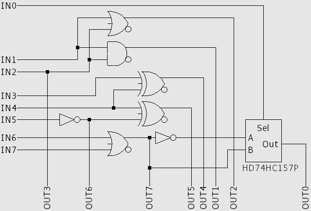

# Darren's Circuit

## Challenge Description

Darren was doing something fishy with lots of wires.
I was able to snap a picture of the circuit along with the source and output! The output doesn't make much sense to me though.
The ICs from left-to-right are the following: HD74HC157P, SN74HC08N, SN74LS32N, SN74LS86N, SN74LS04N.

## Arduino source code

We get the source code file

```cpp
char * flag = "REDACTED";
String curr;
int out0=46, out1=47, out2=48, out3=49, out4=50, out5=51, out6=52, out7=53;
int in0=24, in1=25, in2=26, in3=27, in4=28, in5=29, in6=30, in7=35;
int i;

String get_output(String bits) {
    String output;
    digitalWrite(out0, ((bits[7] == '1')? HIGH : LOW));
    digitalWrite(out1, ((bits[6] == '1')? HIGH : LOW));
    digitalWrite(out2, ((bits[5] == '1')? HIGH : LOW));
    digitalWrite(out3, ((bits[4] == '1')? HIGH : LOW));
    digitalWrite(out4, ((bits[3] == '1')? HIGH : LOW));
    digitalWrite(out5, ((bits[2] == '1')? HIGH : LOW));
    digitalWrite(out6, ((bits[1] == '1')? HIGH : LOW));
    digitalWrite(out7, ((bits[0] == '1')? HIGH : LOW));
    
    delay(500);
    output += String(digitalRead(in7));
    output += String(digitalRead(in6));
    output += String(digitalRead(in5));
    output += String(digitalRead(in4));
    output += String(digitalRead(in3));
    output += String(digitalRead(in2));
    output += String(digitalRead(in1));
    output += String(digitalRead(in0));
    return output;
}

//converts a given number into binary
String binary(int number) {
  String r;
  while(number!=0) {
    r = (number % 2 == 0 ? "0" : "1")+r; 
    number /= 2;
  }
  while ((int) r.length() < 8) {
    r = "0"+r;
  }
  return r;
}

void setup() {
  i = 0;
  pinMode(out0, OUTPUT);
  pinMode(out1, OUTPUT);
  pinMode(out2, OUTPUT);
  pinMode(out3, OUTPUT);
  pinMode(out4, OUTPUT);
  pinMode(out5, OUTPUT);
  pinMode(out6, OUTPUT);
  pinMode(out7, OUTPUT);

  pinMode(in0, INPUT);
  pinMode(in1, INPUT);
  pinMode(in2, INPUT);
  pinMode(in3, INPUT);
  pinMode(in4, INPUT);
  pinMode(in5, INPUT);
  pinMode(in6, INPUT);
  pinMode(in7, INPUT);
  Serial.begin(9600);
}

void loop() {
  if (i < strlen(flag)) {
    curr = binary(flag[i]);
    Serial.println(get_output(curr));
    delay(500);
    i++;
  }
}
```

From the source code, we see that every for every character (byte) the function `get_output` is called.
The function writes each bit on a seperate output pin, waits for propogation delay, and reads the input and prints to the serial monitor.
As we are not getting more information from the code, we have to look at the hardware.

## Hardware reversing

With the challenge comes a few image files, `circuit_schematic.png` and `circuit.jpg`.
Of the two, `circuit_schematic.png` is the most interesting.


From the challenge description, we know that the ICs from left-to-right are: HD74HC157P, SN74HC08N, SN74LS32N, SN74LS86N, SN74LS04N.
When googling the datasheets, we get the following IC descriptions.

+ HD74HC157P: Quad. 2-to-1-line Data Selectors/Multiplexers (with noninverted outputs)
+ SN74HC08N: Quadruple 2-Input AND Gates
+ SN74LS32N: Quadruple 2-Input OR Gates
+ SN74LS86N: Quadruple 2-Input Exclusive-OR Gates
+ SN74LS04N: Hex Inverters

From these functions (along with looking at the pinout for each IC), the following gate-level schematic is discovered.



From the reverse-engineered schematic, the following relations must be true.

1) `IN2 = OUT3`
2) `IN5 = ~OUT6`
3) `IN6 | IN7 = OUT7`
4) `IN4 ^ OUT6 = OUT 5`
5) `IN3 ^ IN4 = OUT4`
6) `IN1 & IN2 = OUT1`
7) `IN1 | IN2 = OUT2`

Since all input chars are ASCII (which we can see from the source code), we can assume that `IN7 = 0` (since all ASCII values are less than 0x80).
This means the can solve for all inputs now.
If this next part is not clear to you, try to set up truth tables for each equation in terms of inputs and outputs (and look for the pattern).

1) `IN2 = OUT3`
2) `IN5 = ~OUT6`
3) `IN6 = OUT7`
4) `IN4 = OUT5 ^ OUT6`
5) `IN3 = OUT4 ^ OUT5 ^ OUT6`
6) `IN1 = OUT3 ? OUT1 : OUT2`
7) `IN0 = OUT7 == OUT0`
8) `IN7 = 0`

## Decode script

We can now use the expressions for each input in a python decode script.

```Python
def bitsToByte(bits):
    byte = 0
    for i, b in enumerate(bits):
        byte |= b << i
    return byte

def decode(s):
    outbits  = [int(s[7-i]) for i in range(0,8)]
    inbits = [0 for i in range(8)]
    inbits[0] = 1 if outbits[7] == outbits[0] else 0
    inbits[1] = outbits[1] if outbits[3] else outbits[2]
    inbits[2] = outbits[3]
    inbits[3] = outbits[4] ^ outbits[5] ^ outbits[6]
    inbits[4] = outbits[5] ^ outbits[6]
    inbits[5] = 1 if not outbits[6] else 0
    inbits[6] = outbits[7]
    inbits[7] = 0
    return chr(bitsToByte(inbits))

with open("output.txt", "r") as f:
    ls = f.readlines()

ls = list(map(lambda x: x.strip(), ls))
output = list(map(lambda l: decode(l), ls))
output = "".join(output)
print(output)
```

Running the decode script yields the flag `flag{abcdefghijklmnopqrstuvwxyz}`
